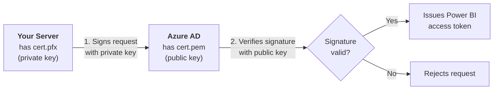
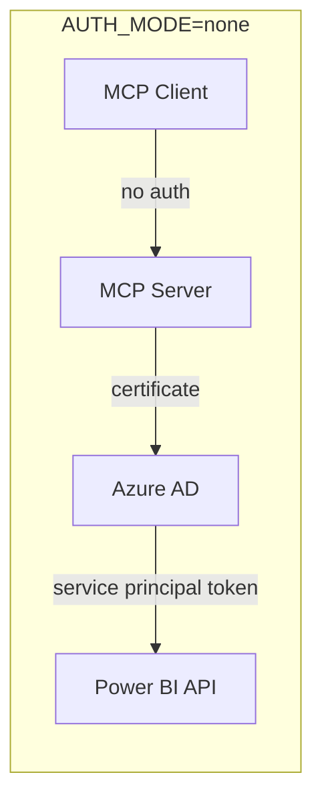
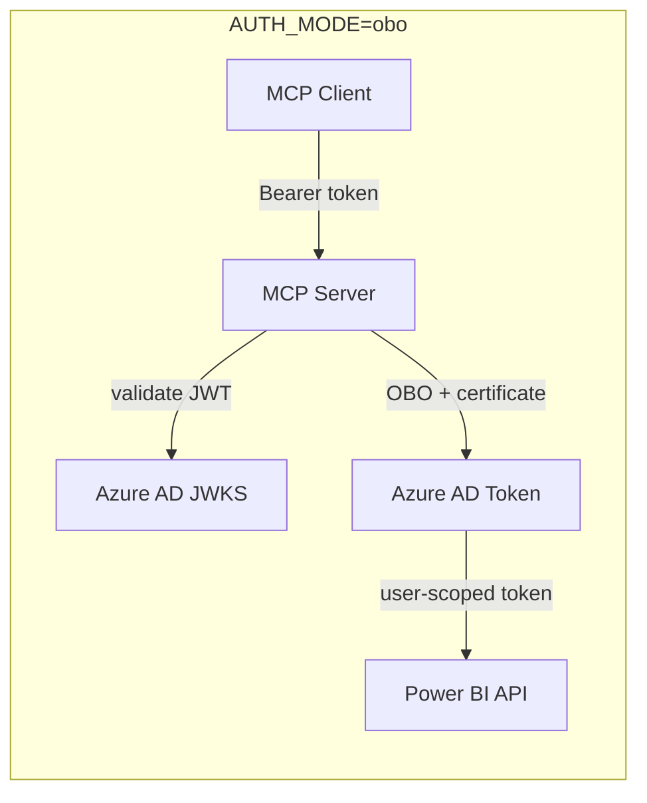
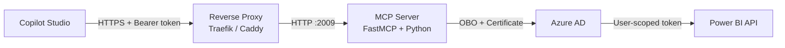
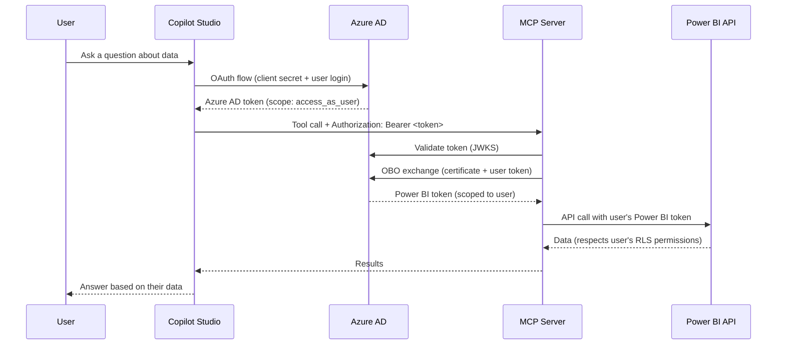

# Power BI MCP Server

Self-hosted [MCP](https://modelcontextprotocol.io/) server for querying Power BI semantic models. Retrieves model schemas (tables, columns, measures, relationships) and executes DAX queries — all via the Power BI REST API and Microsoft Fabric API.

Built with [FastMCP](https://github.com/jlowin/fastmcp) (Python). Compatible with any MCP client including Claude Desktop and Microsoft Copilot Studio.

## Capacity Requirements

This server calls the Power BI REST API (`executeQueries`) and Microsoft Fabric API (`getDefinition`). These APIs are only available on datasets hosted in one of the following capacities:

| Capacity | SKU | Notes |
|---|---|---|
| **Power BI Premium** | P1–P5 | Org-wide dedicated capacity |
| **Power BI Premium Per User** | PPU | Per-user Premium license |
| **Power BI Embedded** | A/EM | Azure-provisioned capacity for embedding |
| **Microsoft Fabric** | F2+ | Any Fabric capacity — includes full Power BI semantic model API access |

Datasets on shared (Pro-only) capacity **will not work** — the `executeQueries` and `getDefinition` endpoints return 403.

## How It Works

1. Authenticates as an Azure AD **service principal** via MSAL (certificate-based)
2. Discovers workspaces, datasets, and reports via the Power BI REST API
3. Fetches semantic model definitions through the Fabric `getDefinition` API (TMDL format)
4. Parses TMDL to extract tables, columns (with data types), measures (with DAX expressions), and relationships
5. Executes DAX queries via the Power BI `executeQueries` REST endpoint

All API calls include automatic retry handling for rate limiting (HTTP 429).

## MCP Tools

### Discovery

#### `list_workspaces`

Lists all Power BI workspaces accessible to the service principal. Use this as a starting point to discover available datasets and reports.

**Inputs:** None

#### `list_datasets`

Lists datasets (semantic models) in a workspace, or across all accessible workspaces when `workspace_id` is omitted.

**Inputs:**
- `workspace_id` (string, optional) — Scope to a single workspace (faster). Omit to list across all workspaces.

#### `list_reports`

Lists reports in a workspace, or across all accessible workspaces when `workspace_id` is omitted.

**Inputs:**
- `workspace_id` (string, optional) — Scope to a single workspace (faster). Omit to list across all workspaces.

### Schema & Queries

#### `get_semantic_model_schema`

Retrieves the full schema of a Power BI semantic model: tables, columns (with data types), measures (with DAX expressions), and relationships. Use this to understand the model structure before writing DAX queries.

**Inputs:**
- `dataset_id` (string, required) — The Power BI dataset/semantic model ID
- `workspace_id` (string, optional) — Workspace ID to skip auto-detection (faster)

#### `execute_dax_query`

Executes a DAX query against a semantic model and returns structured results with column names and rows.

**Inputs:**
- `dataset_id` (string, required) — The Power BI dataset/semantic model ID
- `dax_query` (string, required) — The DAX query to execute

### Typical Flow

```
list_workspaces → list_datasets(workspace_id) → get_semantic_model_schema(dataset_id) → execute_dax_query(dataset_id, dax_query)
```

## Authentication

The server needs to prove its identity to Azure AD every time it requests a Power BI token. This is true for **both** auth modes — without a valid credential, Azure AD won't issue any tokens and the server can't access Power BI at all.

### How certificate authentication works

A certificate is a cryptographic key pair: a **private key** (secret, stays on your server) and a **public key** (shared with Azure AD).



**What goes where:**

| File | Location | Purpose |
|---|---|---|
| `cert.pfx` | Your server (local file) | Contains the private key. MSAL uses it to sign authentication requests. **Never share this.** |
| `cert.pem` | Uploaded to Azure AD app registration | Contains the public key. Azure AD uses it to verify that requests really came from your server. |

**Why not a client secret?** A client secret is just a password string that sits in your `.env` file — it can be copy-pasted, leaked in logs, or accidentally committed. A certificate private key is a binary file that's much harder to accidentally expose, and `.env` only contains the file path.

**Why upload the public key to Azure AD?** Azure AD needs to verify your server's identity. When your server signs a request with the private key, Azure AD checks the signature against the public key on file. If they match, it knows the request is legitimate.

### Auth Modes





#### `AUTH_MODE=none` (default)

No authentication on the MCP endpoint. The server uses the service principal's certificate to access Power BI via client credentials. All requests use the same service principal identity.

**Use for:** Local development, trusted networks, MCP Inspector testing.

#### `AUTH_MODE=obo` (recommended for production)

The MCP endpoint requires a valid Azure AD bearer token. The server:
1. Validates the token using Azure AD's JWKS endpoint (supports both v1.0 and v2.0 tokens)
2. Exchanges it for a Power BI token via the On-Behalf-Of (OBO) flow
3. Power BI access is scoped to the calling user — respects Row-Level Security (RLS)

**Use for:** Production deployments, Copilot Studio integration.

Required `.env` settings:
```
AUTH_MODE=obo
MCP_BASE_URL=https://your-mcp-server.example.com
```

## Prerequisites

- **Python 3.12+** with [UV](https://docs.astral.sh/uv/)
- **Azure CLI** (`az`) and **OpenSSL** for setup
- **Azure AD app registration** with a certificate credential
- Semantic models hosted on **Premium, PPU, Embedded, or Fabric** capacity
- Service principal added as **Member** of the target Power BI workspace

## Quick Start

```bash
# Install dependencies
uv sync

# Run the setup script (creates app registration, certificate, permissions)
./setup_azure_auth.sh

# Or configure manually: copy .env.example and edit
cp .env.example .env

# Start the server
uv run python main.py
```

Server starts on `http://0.0.0.0:2009` with Streamable HTTP transport.

## Azure AD Setup

### Automated (recommended)

The setup script creates an app registration, service principal, certificate, and configures all permissions including OBO:

```bash
./setup_azure_auth.sh
```

Requires the [Azure CLI](https://learn.microsoft.com/en-us/cli/azure/install-azure-cli) and `openssl`. Generates `cert.pfx` in the project root and writes configuration to `.env`.

### Manual

1. Register an app in **Azure AD (Entra ID)**
2. Generate a self-signed certificate:
   ```bash
   openssl req -x509 -newkey rsa:2048 -keyout private.key -out cert.pem -days 365 -nodes -subj "/CN=PowerBI-MCP-Server"
   openssl pkcs12 -export -out cert.pfx -inkey private.key -in cert.pem -passout pass:
   rm private.key
   ```
3. Upload the certificate to the app registration:
   ```bash
   az ad app credential reset --id <your-client-id> --cert @cert.pem --append
   ```
4. Under **API Permissions**, add **Power BI Service**:
   - Application: `Dataset.Read.All` (required), `Workspace.Read.All`, `Report.Read.All` (optional)
   - Delegated: `Dataset.Read.All` (required for OBO)
   - Delegated: `SemanticModel.ReadWrite.All` (required for OBO — the Fabric `getDefinition` API is classified as a write operation even though it only reads schema data)
5. **Grant admin consent** — both admin consent and explicit scope grant:
   ```bash
   az ad app permission admin-consent --id <your-client-id>

   # Explicit scope grant (required for OBO — ensures Azure AD includes all scopes in the token)
   az ad app permission grant --id <your-client-id> \
     --api 00000009-0000-0000-c000-000000000000 \
     --scope "Dataset.Read.All Report.Read.All Workspace.Read.All SemanticModel.ReadWrite.All"
   ```
6. In **Power BI Admin Portal** → Tenant settings → Developer settings:
   - Enable **"Service principals can call Fabric public APIs"**
7. Under **Expose an API**:
   - Set Application ID URI to `api://<your-client-id>`
   - Add scope `access_as_user` (type: User)
8. In the app **Manifest**, set `requestedAccessTokenVersion: 2`
9. In **Power BI Admin Portal** → Tenant settings → Developer settings:
   Enable **"Allow service principals to use Power BI APIs"**
10. In your **Power BI workspace** → Settings → Access:
   Add the service principal as a **Member**

> Steps 4 (delegated), 6-8 are only needed for `AUTH_MODE=obo`. For `AUTH_MODE=none`, only application permissions, Fabric API access, and workspace membership are required.

## Configuration

All settings via environment variables (`.env`):

| Variable | Default | Description |
|---|---|---|
| `TENANT_ID` | — | Azure AD tenant ID |
| `CLIENT_ID` | — | Azure AD app (client) ID |
| `CLIENT_CERT_PATH` | — | Path to PFX certificate file (use absolute path) |
| `CLIENT_CERT_BASE64` | — | Base64-encoded PFX (alternative to path, for containers) |
| `CLIENT_CERT_PASSPHRASE` | — | PFX passphrase (optional) |
| `AUTH_MODE` | `none` | Auth mode: `none` or `obo` |
| `MCP_BASE_URL` | — | Server public URL (required for `obo`) |
| `MCP_TRANSPORT` | `http` | Transport type: `http` or `stdio` |
| `MCP_PORT` | `2009` | Server port (HTTP mode) |
| `LOG_LEVEL` | `INFO` | Log level |

## Testing Locally

### Testing with `AUTH_MODE=none`

Start the server and connect MCP Inspector — no auth needed:

```bash
# Start the server
uv run python main.py

# In another terminal
npx @modelcontextprotocol/inspector http://localhost:2009/mcp
```

MCP Inspector opens in your browser. Click **List Tools** to see all available tools, then call them directly.

### Testing OBO with curl

OBO requires a valid Azure AD token. Here's the full flow:

**1. Get a token:**

```bash
# Login to the correct tenant
az login --tenant <your-tenant-id>

# Get a token for the MCP server's API scope
TOKEN=$(az account get-access-token \
  --resource "api://<your-client-id>" \
  --query accessToken -o tsv)
```

> **Note:** Azure CLI often returns v1.0 tokens (issuer `https://sts.windows.net/...`) even when `requestedAccessTokenVersion` is set to 2. The server accepts both v1.0 and v2.0 tokens.

**2. Initialize an MCP session:**

```bash
INIT=$(curl -s -D - \
  -H "Authorization: Bearer $TOKEN" \
  -H "Content-Type: application/json" \
  -H "Accept: application/json, text/event-stream" \
  -X POST http://localhost:2009/mcp \
  -d '{"jsonrpc":"2.0","method":"initialize","params":{"protocolVersion":"2024-11-05","capabilities":{},"clientInfo":{"name":"test","version":"1.0"}},"id":1}')

SESSION=$(echo "$INIT" | grep -i mcp-session-id | tr -d '\r' | awk '{print $2}')
echo "Session: $SESSION"
```

**3. Call a tool:**

```bash
curl -s \
  -H "Authorization: Bearer $TOKEN" \
  -H "Content-Type: application/json" \
  -H "Accept: application/json, text/event-stream" \
  -H "Mcp-Session-Id: $SESSION" \
  -X POST http://localhost:2009/mcp \
  -d '{"jsonrpc":"2.0","method":"tools/call","params":{"name":"list_workspaces","arguments":{}},"id":2}'
```

### Testing OBO with MCP Inspector

MCP Inspector's CLI `--header` flag does **not** forward custom headers to the MCP server — this is a [known limitation](https://github.com/modelcontextprotocol/inspector/issues/879).

**Workaround — use the Web UI:**

1. Start MCP Inspector: `npx @modelcontextprotocol/inspector`
2. In the browser UI, select **Streamable HTTP** transport
3. Enter the server URL: `http://localhost:2009/mcp`
4. In the **Bearer Token** field, paste your token (from `az account get-access-token`)
5. Click **Connect**

**Alternative:** Test tools with `AUTH_MODE=none` in MCP Inspector, and verify OBO auth separately with curl.

## Production Deployment

### Architecture



### Requirements

- **HTTPS is mandatory** — Copilot Studio requires a trusted TLS certificate (self-signed won't work)
- **Public DNS** — your server needs a domain name reachable from Microsoft's cloud
- **Port 443** — open in your router/firewall

### Deploying on Coolify (Nixpacks)

Coolify auto-detects Python/UV projects via `pyproject.toml` and `uv.lock`:

1. Create a new service in Coolify, point to your Git repository
2. Coolify/Nixpacks runs `uv sync --no-dev --frozen` automatically
3. Set the start command: `uv run python main.py`
4. Base64-encode your certificate (run this locally):
   ```bash
   base64 -i cert.pfx | tr -d '\n'
   ```
5. Configure environment variables in Coolify's UI:
   ```
   TENANT_ID=<your-tenant-id>
   CLIENT_ID=<your-client-id>
   CLIENT_CERT_BASE64=<paste base64 string from step 4>
   CLIENT_CERT_PASSPHRASE=
   AUTH_MODE=obo
   MCP_BASE_URL=https://your-domain.com
   MCP_TRANSPORT=http
   MCP_PORT=2009
   LOG_LEVEL=INFO
   ```
   > Use `CLIENT_CERT_BASE64` instead of `CLIENT_CERT_PATH` — the server decodes it to a temp file at startup. No file mounting needed.
6. Assign your domain in Coolify — Traefik handles TLS termination and Let's Encrypt certificates automatically
7. Set the exposed port to `2009` in Coolify's network settings

### Alternative: Caddy as reverse proxy

If not using Coolify's built-in Traefik:

```
your-domain.com {
    reverse_proxy localhost:2009
}
```

Caddy automatically provisions and renews Let's Encrypt certificates.

## Copilot Studio Connection

### Prerequisites (Azure AD app registration)

Before connecting Copilot Studio, your app registration needs additional configuration beyond the basic setup:

1. **Redirect URIs** — add these under **Authentication → Web → Redirect URIs**:
   ```
   https://token.botframework.com/.auth/web/redirect
   ```
   > A second redirect URI is needed for your specific connector. On the first sign-in attempt, Azure AD will show an error like `AADSTS50011` with the exact URI — add that one too. It looks like: `https://global.consent.azure-apim.net/redirect/<your-connector-name>`

2. **Client secret for Copilot Studio** — Copilot Studio needs its own credential to exchange auth codes with Azure AD. This is separate from the MCP server's certificate:
   ```bash
   az ad app credential reset --id <your-client-id> \
     --append --display-name "Copilot Studio" --years 1 \
     --query password -o tsv
   ```
   Save the output — you'll paste it into Copilot Studio.

3. **Verify these are already set** (from the Azure AD Setup section):
   - Identifier URI: `api://<your-client-id>`
   - Exposed scope: `access_as_user`
   - `requestedAccessTokenVersion: 2` in the app manifest
   - Delegated permission: Power BI `Dataset.Read.All`
   - Admin consent granted

### Connecting your agent

1. In Copilot Studio, ensure **Generative Orchestration** is enabled on your agent
2. Go to **Tools → Add Tool → New Tool → MCP**
3. Enter your server's HTTPS URL: `https://<your-domain>/mcp`
4. Select **OAuth 2.0** → **Manual**
5. Fill in the OAuth configuration:

| Field | Value |
|---|---|
| **Client ID** | `<your-client-id>` |
| **Client Secret** | the secret from the prerequisite step above |
| **Authorization URL** | `https://login.microsoftonline.com/<your-tenant-id>/oauth2/v2.0/authorize` |
| **Token URL** | `https://login.microsoftonline.com/<your-tenant-id>/oauth2/v2.0/token` |
| **Refresh URL** | same as Token URL |
| **Scope** | `api://<your-client-id>/access_as_user` |

6. Click **Create**
7. Sign in when prompted — Azure AD will authenticate you and consent to the scope
8. Copilot Studio auto-discovers all tools from the server

> **Important:** Copilot Studio requires **Streamable HTTP** transport. SSE transport is deprecated.

### How it works



**Key point:** The client secret in Copilot Studio is only used by Copilot Studio to talk to Azure AD. The MCP server never sees it — it authenticates to Azure AD using its own PFX certificate. Two separate credentials, two separate purposes.

## MCP Client Configuration

### Claude Desktop

Add to your Claude Desktop MCP config (`claude_desktop_config.json`):

```json
{
  "mcpServers": {
    "powerbi": {
      "url": "http://localhost:2009/mcp"
    }
  }
}
```

## Testing

```bash
uv run pytest
```

## License

MIT
